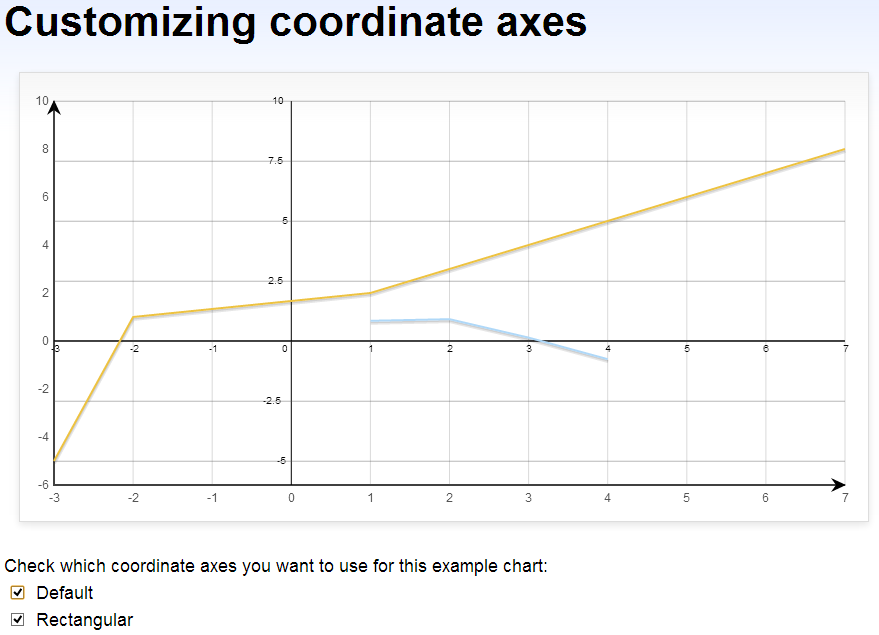

jquery.flot.coordinate.js
=========================

Flot plugin that adds some extra coordinates in function graphing.
------------------------------------------------------------------

**Usage:**

Inside the `<head></head>` area of your html page, add the following lines:
    
```html
<script type="text/javascript" src="http://zizhujy.com/Scripts/flot/jquery.flot.coordinate.js"></script>
```

Now you are all set. This plugin will draw a default coordinate axes for you.

**Online examples:**

http://zizhujy.com/Plotter is using it, you can take a look to get the first impression about what this plugin can do.

**Dependencies:**

- jquery.js
- jquery.flot.js

**Customizations:**

The coordinate type are accessed as strings separated by pipe line '|' through the coordinate option:

```javascript
options{
    coordinate: {
        type: 'rectangular|default'
    }
}
```

**Online demos:**

- [Online plotter](http://zizhujy.com/plotter "Online plotter")
- [Online Function Grapher](http://zizhujy.com/functiongrapher "Online Function Grapher")

**Screenshots:**

